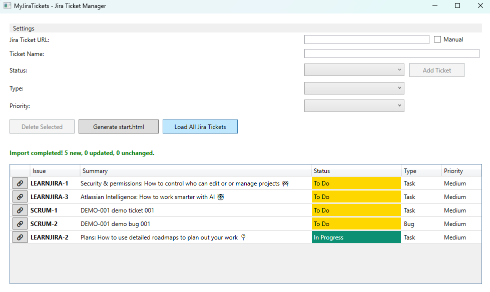
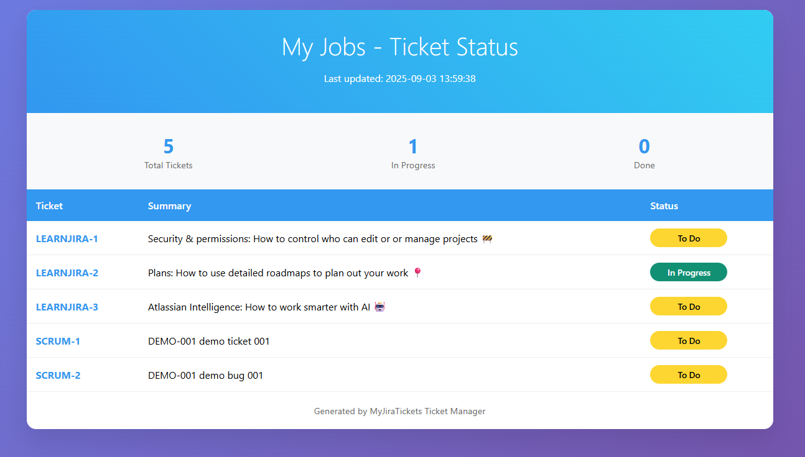

# MyJiraTickets - WPF Application with Browser Extension

A comprehensive WPF application for managing Jira tickets with local SQLite storage and browser extension integration. Features automatic Jira API synchronization, manual ticket entry, and HTML export for new tab extensions.

## Features

### Ticket Management
- **Manual ticket entry** - Add tickets manually with customizable fields
- **Jira integration** - Automatically fetch ticket details from Jira REST API
- **Hybrid mode** - Combine manual entries with Jira data
- **Local database** - SQLite storage for offline access
- **Secure deletion** - Case-sensitive ticket deletion with confirmation

### Jira Integration
- Fetches ticket details automatically when you enter a Jira ticket key
- Populates Summary, Status, Type, and Priority from Jira
- Works with Jira Cloud instances
- Manual mode available when Jira is not accessible

### HTML Generation
- Generates `start.html` file for browser extensions
- Exports all tickets to HTML format
- Configurable output path
- Perfect for new tab page extensions

### Interface Preview:


### New Browser Tab Preview:


## Installation & Setup

### Prerequisites
- .NET 9.0 or later
- Windows OS (WPF application)

### Configuration

1. Copy `appsettings.template.json` to `appsettings.json`
2. Edit the configuration file with your settings:

```json
{
  "Jira": {
    "BaseUrl": "https://your-company.atlassian.net/",
    "Username": "your-email@company.com",
    "Password": "your-api-token-here",
    "ApiKey": "your-api-token-here"
  },
  "StartHtmlPath": "D:\\MyApps\\Extensions\\StartExtension\\start.html",
  "HtmlContentId": "jira",
  "Mode": "jira",
  "DatabasePath": "D:\\MyApps\\sqlitedb\\tickets.db"
}
```

### Configuration Parameters

- **Jira.BaseUrl**: Your Jira instance URL
- **Jira.Username**: Your Jira email address
- **Jira.Password/ApiKey**: Your Jira API token (get from Jira Account Settings)
- **StartHtmlPath**: Where to generate the HTML file for browser extension
- **HtmlContentId**: HTML element ID for content injection
- **Mode**: `"jira"` for Jira integration, `"manual"` for offline mode
- **DatabasePath**: Location of SQLite database file

### Getting Jira API Token

1. Go to your Jira Account Settings
2. Navigate to Security → API tokens
3. Create a new API token
4. Copy the token to both `Password` and `ApiKey` fields

## Usage

### Starting the Application

1. Run the application
2. Configure your settings through the Settings window
3. Choose your mode:
   - **Jira Mode**: Enables automatic ticket fetching
   - **Manual Mode**: Local database only

### Adding Tickets

#### Automatic (Jira Mode):
1. Enter a Jira ticket key (e.g., `PROJ-123`)
2. Application automatically fetches and populates ticket details
3. Verify the information and click "Add Ticket"

#### Manual Entry:
1. Switch to Manual Mode or enter custom data
2. Fill in ticket details manually:
   - Ticket Name/Key
   - Status (To Do, In Progress, Done)
   - Type (Task, Bug, Story)
   - Priority (Low, Medium, High, Critical)
3. Click "Add Ticket"

### Deleting Tickets

1. Select a ticket from the list
2. Click "Delete Selected"
3. A confirmation dialog appears
4. **Type the exact ticket key** (case-sensitive) to confirm deletion
5. Click "Delete" to permanently remove the ticket

### Loading from Jira

- Click "Load All Jira Tickets" to fetch all tickets from your Jira projects
- Application will import new tickets and update existing ones
- Status message shows import results
- **Manual loading only** - tickets are only fetched when explicitly requested

### Generating HTML for Browser Extension

1. Click "Generate start.html"
2. HTML file is created at the configured path
3. Use this file in your browser extension as a new tab page
4. The HTML contains all your tickets in a formatted layout

## Browser Extension Integration

The generated `start.html` file can be used with browser extensions to show your tickets on new tab pages.

### What's Included

The `StartExtension` folder contains a complete browser extension:
- **manifest.json** - Extension configuration
- **start.html** - Generated ticket display page  
- **script.js** - Extension logic
- **background.js** - Background processing
- **icon48.png** & **icon128.png** - Extension icons

### Installation Instructions

#### For Chrome:
1. Open Chrome and navigate to `chrome://extensions/`
2. Enable "Developer mode" (toggle in top-right corner)
3. Click "Load unpacked" button
4. Navigate to the `Extensions/StartExtension/` folder
5. Select the folder and click "Select Folder"

#### For Edge:
1. Open Edge and navigate to `edge://extensions/`
2. Enable "Developer mode" (toggle in left sidebar)
3. Click "Load unpacked" button  
4. Navigate to the `Extensions/StartExtension/` folder
5. Select the folder and click "Select Folder"

### How It Works

1. Use MyJiraTickets application to manage your tickets
2. Click "Generate start.html" to create/update the extension content
3. The extension automatically displays your tickets when you open a new tab
4. Tickets are shown with color-coded statuses and clickable links

## Technical Details

### Database
- **Type**: SQLite
- **Location**: Configurable (default: `sqlitedb/tickets.db`)
- **Schema**: Stores ticket key, summary, status, type, priority, and timestamps
- **Backup**: Database file can be copied for backup purposes

### Application Modes

#### Jira Mode
- Automatically fetches ticket details from Jira when you enter a ticket key
- Requires valid Jira configuration
- **Manual loading** - tickets are only fetched when "Load All Jira Tickets" is clicked
- No automatic background syncing

#### Manual Mode
- Completely offline operation
- All ticket data entered manually
- Useful when Jira access is not available

### Security Features
- **Case-sensitive deletion confirmation**: Prevents accidental ticket deletion
- **API token authentication**: Secure Jira access
- **Local database storage**: No cloud dependencies for ticket storage
- **Manual sync only**: No automatic data transmission to/from Jira
- **Sensitive data protection**: Configuration files are excluded from version control

## Project Structure

```
MyJiraTicketsDotNetAndBrowserExtension/
├── MyJiraTickets/                    # Main WPF application
│   ├── Models/                       # Data models
│   │   ├── AppSettings.cs           # Configuration model
│   │   ├── Ticket.cs                # Ticket data model
│   │   └── TicketDatabase.cs        # Database operations
│   ├── Services/                     # Business logic
│   │   └── JiraService.cs           # Jira API integration
│   ├── Windows/                      # UI Windows
│   │   ├── MainWindow.xaml          # Main application window
│   │   ├── SettingsWindow.xaml      # Settings configuration
│   │   ├── EditTicketWindow.xaml    # Ticket editing dialog
│   │   └── DeleteConfirmationWindow.xaml # Deletion confirmation
│   ├── appsettings.template.json    # Configuration template
│   └── MyJiraTickets.csproj         # Project file
├── Extensions/
│   └── StartExtension/               # Browser extension
│       ├── manifest.json            # Extension manifest
│       ├── start.html               # Generated ticket page
│       ├── script.js                # Extension logic
│       ├── background.js            # Background processing
│       └── icons/                   # Extension icons
├── sqlitedb/                        # Database storage
└── README.md                        # This file
```

## Development

### Building the Application
1. Open the solution in Visual Studio 2022 or later
2. Restore NuGet packages
3. Build the solution (Ctrl+Shift+B)
4. Run the application (F5)

### Dependencies
- .NET 9.0 Windows Desktop Runtime
- Microsoft.Data.Sqlite (for database operations)
- Newtonsoft.Json (for JSON handling)
- RestSharp (for HTTP requests to Jira API)

## Troubleshooting

### Jira Connection Issues
- Verify your API token is valid and not expired
- Check the Jira BaseUrl format (must include https://)
- Ensure your Jira account has appropriate permissions
- Test the connection using a REST client first

### Database Issues
- Ensure the database directory exists and is writable
- Check file permissions for the database location
- Database is created automatically on first run
- Verify SQLite dependencies are installed

### HTML Generation Issues
- Verify the output directory exists and is writable
- Check file permissions for the HTML output path
- Ensure the path in configuration uses proper format
- Regenerate the HTML file if tickets don't appear

### Browser Extension Issues
- Make sure Developer mode is enabled in your browser
- Verify the extension folder contains all required files
- Check browser console for error messages
- Refresh the extension after updating start.html

## License

This project is licensed under the MIT License. See the LICENSE file for details.

## Contributing

1. Fork the repository
2. Create a feature branch
3. Make your changes
4. Test thoroughly
5. Submit a pull request

## Support

For issues or feature requests, please create an issue in the GitHub repository.

